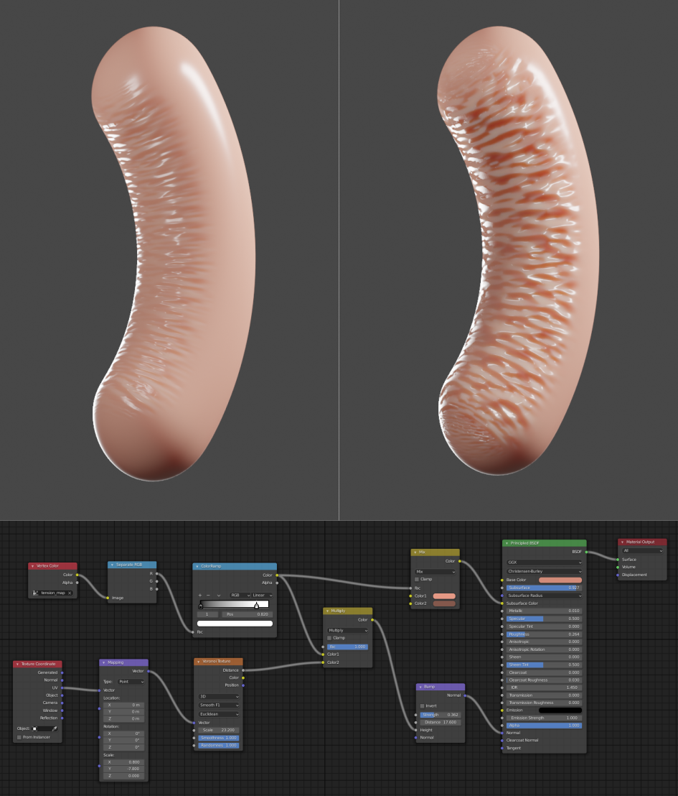
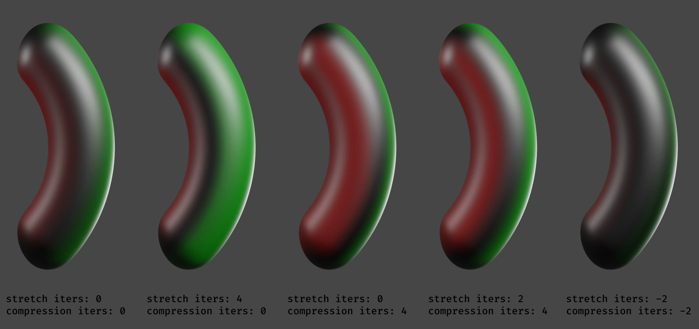

# Blender Mesh Tension Add-On
  

This implementation branches off from version 1.5.2 of Steve Miller's (BA: @shteeve) implementation of a Blender add-on for computing mesh tension. You can follow the development [over on BlenderArtists](https://blenderartists.org/t/revised-mesh-tension-add-on/1239091/45). For using, simply install the `mesh_tension.py` script as an add-on through the Blender preferences.

Here's an example of what can be achieved using the add-on:

## Changelog

### Version 1.5.5

Minor code cleanup:
- Add a missing `not` in frame change handler check

### Version 1.5.4

Minor code cleanup:
- Use logger instead of warnings
- Fix `load_post` to use `bpy.context.scene` since the arg is None.
- Add checks before registering and unregistering handlers

### Version 1.5.3

- **Code refactor**
Remove duplicate code through reusable functions and module level constants. Remove multiple return paths. Add type annotations and Pep8 compliant documentation. Clean up code execution paths. Simplify data-structures replacing lists with dictionaries.
- **Tension Props Setup and Cleanup**
Explicitly add, and remove, tension properties on objects in response to enabling or disabling mesh tension. The addition didn't work for me on 2.93 until the frame change handlers were triggered. Disabling tension also left the tension properties on the object, these are now cleaned up.
- **Independent stretch and compression propagation**
Control stretch and compression propagation through separate parameters to allow for interaction of the effects. For each, positive iterations denote dilation, negative denote erosion. The effects are additively blended for vertices that end up with both tension measures after tension propagation. Here's a quick demo:

